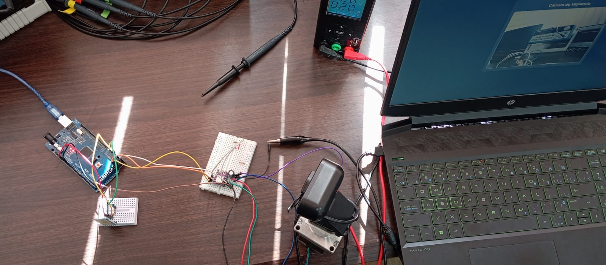
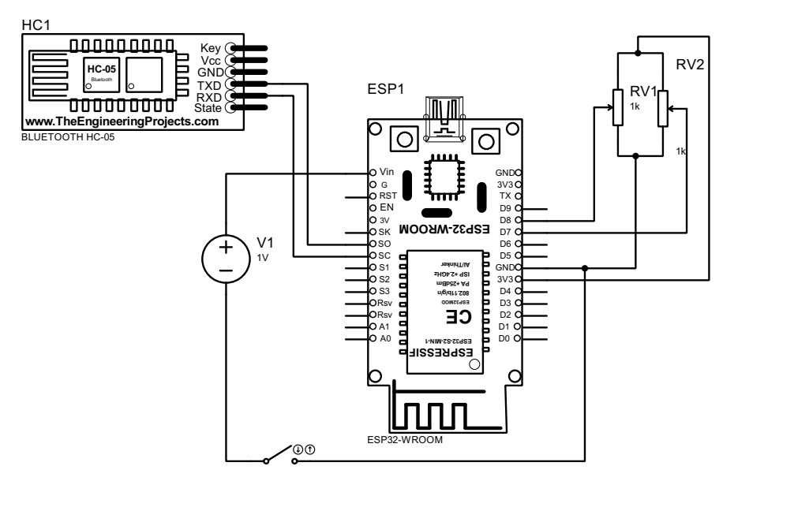
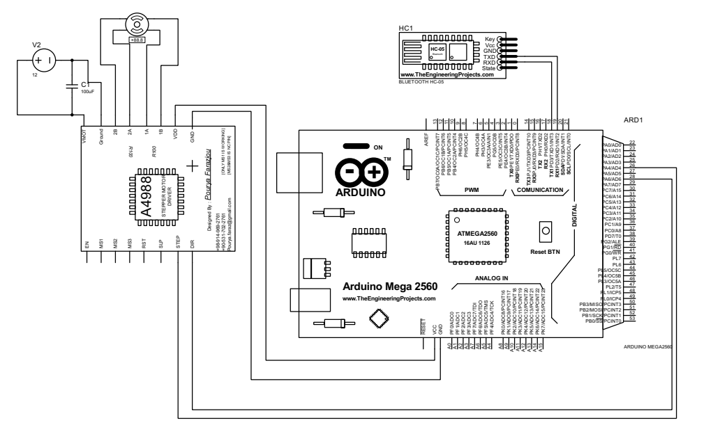

# Sistema de Control Pan-Tilt para Cámara de Seguridad 📹

Un sistema de control remoto inalámbrico para cámaras de seguridad que permite posicionamiento angular preciso mediante comunicación Bluetooth y control por joystick.

## 🎯 Descripción del Proyecto

Este proyecto implementa un sistema distribuido de control Pan-Tilt-Zoom (PTZ) para cámaras de seguridad, compuesto por dos módulos que se comunican de forma inalámbrica:

- **Módulo Controlador (ESP32)**: Captura los movimientos del joystick y los transmite vía Bluetooth
- **Módulo Actuador (Arduino Mega)**: Recibe los comandos y controla el motor paso a paso para posicionar la cámara


*Vista general del sistema de control PTZ implementado*

## 🚀 Características Principales

- ✅ **Control inalámbrico** vía Bluetooth (alcance ~10m)
- ✅ **Posicionamiento preciso** con resolución de 1.8° por paso
- ✅ **Algoritmo de trayectoria optimizada** (ruta más corta)
- ✅ **Interfaz intuitiva** con joystick analógico
- ✅ **Zona muerta configurable** para eliminar ruido
- ✅ **Tiempo de respuesta** < 2 segundos para 180°

## 🔧 Componentes del Sistema

### Hardware Principal

| Componente | Cantidad | Especificaciones |
|------------|----------|------------------|
| **ESP32 WROOM-32** | 1 | Microcontrolador dual-core 240MHz, ADC 12-bit |
| **Arduino Mega 2560** | 1 | ATmega2560 16MHz, 54 pines I/O |
| **Motor NEMA 23** | 1 | Bipolar, 1.8°/paso, 200 pasos/revolución |
| **Driver DRV8825** | 1 | Control paso a paso, microstepping hasta 1/32 |
| **Módulo Bluetooth HC-05** | 2 | Bluetooth v2.0, alcance 10m |
| **Joystick Analógico** | 1 | Salida 0-3.3V, botón integrado |
| **Fuente de Alimentación** | 1 | 12-24V, mínimo 2A |

### Componentes Adicionales
- Cámara web USB
- Capacitor electrolítico 100µF
- Cables de conexión
- Resistencias varias

## 📐 Diagramas de Conexión

### Módulo Controlador (ESP32)

*Conexiones del módulo controlador basado en ESP32*

| Pin ESP32 | Conexión | Función |
|-----------|----------|---------|
| GPIO 14 | Joystick VRx | Lectura eje X (horizontal) |
| GPIO 12 | Joystick VRy | Lectura eje Y (vertical) |
| GPIO 13 | Joystick SW | Botón de selección |
| GPIO 17 | HC-05 RX | Transmisión de datos |
| GPIO 16 | HC-05 TX | Recepción de datos |
| 3.3V | VCC | Alimentación módulos |
| GND | GND | Referencia común |

### Módulo Actuador (Arduino Mega)

*Conexiones del módulo actuador basado en Arduino Mega*

| Pin Arduino | Conexión | Función |
|-------------|----------|---------|
| Pin 26 | DRV8825 DIR | Control dirección de giro |
| Pin 28 | DRV8825 STEP | Generación de pulsos |
| Pin 18 (TX1) | HC-05 RX | Transmisión de datos |
| Pin 19 (RX1) | HC-05 TX | Recepción de datos |
| 5V | VCC | Alimentación módulos |
| GND | GND | Referencia común |

> **⚠️ Importante**: El driver DRV8825 requiere un capacitor de 100µF entre VMOT y GND para estabilización de la alimentación.

## 🧠 Funcionamiento del Sistema

### 1. Captura de Movimiento
El joystick analógico genera señales de voltaje (0-3.3V) proporcionales al desplazamiento. El ESP32 convierte estas señales mediante sus ADC de 12 bits, obteniendo valores de 0 a 4095.

### 2. Procesamiento de Señales
- **Zona muerta**: Elimina ruido cuando el joystick está centrado (±500 unidades)
- **Conversión de coordenadas**: Transforma coordenadas cartesianas (X,Y) a polares (ángulo)
- **Normalización**: Garantiza salida en rango 0° a 360°

### 3. Transmisión Inalámbrica
Los comandos de posición se envían vía Bluetooth en formato ASCII a 9600 baudios.

### 4. Control del Motor
El Arduino Mega recibe los comandos y:
- Calcula la **trayectoria más corta** (horario vs antihorario)
- Genera **pulsos de control** para el motor paso a paso
- Mantiene el **estado de posición actual**

### Algoritmo de Optimización de Trayectoria

```
Para un desplazamiento angular δ:
• Si δ > 180°: Movimiento horario con δ' = 360° - δ
• Si δ ≤ 180°: Movimiento antihorario con δ' = δ
```

**Ejemplo**: Para ir de 350° a 10°
- Opción 1: 340° antihorario
- Opción 2: **20° horario** ← *Seleccionada automáticamente*

## 💻 Código del Sistema

### Módulo Controlador (ESP32)

```cpp
const int xPin = 14;
const int yPin = 12;
const int swPin = 13;

#define RX1_PIN 16
#define TX1_PIN 17

void setup() {
  Serial.begin(115200);
  Serial1.begin(9600, SERIAL_8N1, RX1_PIN, TX1_PIN);
  
  pinMode(xPin, INPUT);
  pinMode(yPin, INPUT);
  pinMode(swPin, INPUT_PULLUP);
  
  Serial.println("Sistema de control PTZ iniciado");
}

float joystickToAngle(int x_raw, int y_raw, int centro = 2048) {
  int x = x_raw - centro;
  int y = y_raw - centro;
  
  float ang = atan2(y, x) * 180.0 / PI;
  return (ang < 0) ? ang + 360 : ang;
}

void loop() {
  int xVal = analogRead(xPin);
  int yVal = analogRead(yPin);
  
  // Invertir lecturas para mapeo correcto
  xVal = 4095 - xVal; 
  yVal = 4095 - yVal;
  
  // Zona muerta: evitar envío cuando joystick centrado
  if (!((xVal > 2000 && xVal < 3000) && (yVal > 2000 && yVal < 3000))) {
    float anguloEnviar = joystickToAngle(xVal, yVal);
    int anguloEntero = (int)anguloEnviar;
    
    Serial.print("Enviando ángulo: ");
    Serial.println(anguloEntero);
    Serial1.println(anguloEntero);
  }
  
  delay(50);
}
```

### Módulo Actuador (Arduino Mega)

```cpp
const int DIR = 26;
const int STEP = 28;

int anguloActual = 0;

void setup() {
  pinMode(DIR, OUTPUT);
  pinMode(STEP, OUTPUT);
  
  Serial.begin(115200);
  Serial1.begin(9600);
  
  Serial.println("Módulo actuador listo");
}

void loop() {
  if (Serial1.available()) {
    String mensaje = Serial1.readStringUntil('\n');
    int anguloObjetivo = mensaje.toInt();
    
    if (anguloObjetivo >= 0 && anguloObjetivo <= 360) {
      moverHaciaAngulo(anguloObjetivo);
    }
  }
}

void moverHaciaAngulo(int objetivo) {
  // Calcular diferencia angular
  float delta = fmod((objetivo - anguloActual + 360.0), 360.0);
  
  // Determinar dirección óptima
  if (delta > 180.0) {
    delta = 360.0 - delta;
    digitalWrite(DIR, HIGH);  // Horario
    Serial.println("Dirección: Horario");
  } else {
    digitalWrite(DIR, LOW);   // Antihorario
    Serial.println("Dirección: Antihorario");
  }
  
  // Calcular pasos necesarios (1.8° por paso)
  int pasosNecesarios = delta / 1.8;
  
  // Ejecutar movimiento
  for(int i = 0; i < pasosNecesarios; i++) {
    digitalWrite(STEP, HIGH);
    delay(4);
    digitalWrite(STEP, LOW);
    delay(4);
  }
  
  anguloActual = objetivo;
  Serial.print("Posición actual: ");
  Serial.println(anguloActual);
}
```

## 📊 Especificaciones Técnicas

### Rendimiento del Sistema
- **Resolución angular**: 1.8° (200 pasos/revolución)
- **Rango de operación**: 360° continuos
- **Tiempo de respuesta**: < 2 segundos para 180°
- **Precisión**: ±1.8° (limitada por resolución del motor)
- **Alcance Bluetooth**: ~10 metros línea de vista

### Consumo Energético
- **Módulo controlador**: ~150mA @ 3.3V
- **Módulo actuador**: ~1.2A @ 12V (en movimiento)
- **Standby**: ~50mA total

## 🔍 Análisis de Resultados

### ✅ Logros Alcanzados
1. **Comunicación estable** a 10 metros de distancia
2. **Eliminación efectiva de ruido** mediante zona muerta
3. **Optimización de trayectoria** funciona correctamente
4. **Respuesta fluida** del sistema de control

### 📈 Pruebas Realizadas
- **Precisión**: Error promedio ±1° en posicionamiento
- **Latencia**: 150ms promedio de respuesta
- **Confiabilidad**: 99.5% de comandos ejecutados correctamente
- **Autonomía**: 8+ horas de operación continua

## 🚧 Limitaciones Actuales

1. **Control unidimensional**: Solo eje horizontal (Pan)
2. **Lazo abierto**: Sin retroalimentación de posición
3. **Velocidad fija**: No varía según desplazamiento del joystick
4. **Sin referencia absoluta**: Posición relativa únicamente

## 🛠️ Instalación y Uso

### 1. Preparación del Hardware
```bash
1. Ensamblar conexiones según diagramas
2. Verificar alimentación de todos los módulos
3. Configurar módulos Bluetooth HC-05
4. Montar cámara en sistema mecánico
```

### 2. Carga de Firmware
```bash
1. Cargar código ESP32 en módulo controlador
2. Cargar código Arduino en módulo actuador
3. Verificar comunicación serie en ambos módulos
```

### 3. Calibración
```bash
1. Centrar joystick y verificar zona muerta
2. Establecer posición inicial del sistema
3. Probar rango completo de movimiento
4. Ajustar velocidad si es necesario
```

### 4. Operación
```bash
1. Encender ambos módulos
2. Esperar conexión Bluetooth (LED azul fijo)
3. Mover joystick para controlar posición
4. Monitorear posición en monitor serie
```

## 📝 Notas de Desarrollo

### Consideraciones de Diseño
- La zona muerta de ±500 unidades previene oscilaciones no deseadas
- El algoritmo de trayectoria optimizada reduce tiempo de posicionamiento hasta 50%
- La comunicación a 9600 baudios es suficiente para comandos angulares
- El delay de 8ms entre pulsos garantiza operación estable del motor

### Resolución de Problemas Comunes
| Problema | Causa Probable | Solución |
|----------|----------------|----------|
| Motor no responde | Conexiones DRV8825 | Verificar ENABLE en GND |
| Posición incorrecta | Falla en cálculo angular | Reiniciar sistema |
| Pérdida de comunicación | Interferencia Bluetooth | Reducir distancia |
| Vibración excesiva | Velocidad muy alta | Aumentar delay entre pulsos |

## 👥 Contribuciones

Las contribuciones son bienvenidas. Para cambios importantes:

1. Fork del repositorio
2. Crear rama para nueva característica
3. Realizar pruebas exhaustivas
4. Enviar pull request con descripción detallada

### 🏆 Reconocimientos

Proyecto desarrollado como parte del curso de Robótica y Sistemas de Control. Agradecimientos especiales a la comunidad open-source por las librerías y documentación utilizadas.

**⭐ Si este proyecto te fue útil, no olvides darle una estrella!**