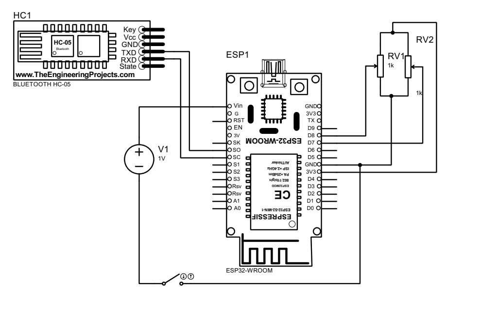

# Sistema de Control Pan-Tilt para Cámara de Seguridad mediante Comunicación Bluetooth

## Resumen

Este proyecto presenta la implementación de un sistema de control remoto para cámaras de seguridad utilizando tecnología de comunicación inalámbrica Bluetooth. El sistema permite el posicionamiento angular preciso en el eje horizontal (pan) mediante la integración de un joystick analógico como interfaz de usuario y un motor paso a paso NEMA 23 como actuador principal. La arquitectura del sistema se basa en una configuración distribuida de dos módulos: un módulo de control remoto basado en ESP32 y un módulo actuador implementado con Arduino Mega.

## Marco Teórico

El control de sistemas electromecánicos remotos constituye un área fundamental en la automatización industrial y sistemas de vigilancia. La implementación de sistemas Pan-Tilt-Zoom (PTZ) para cámaras de seguridad requiere la integración de múltiples tecnologías: sensores de entrada, procesamiento digital de señales, comunicación inalámbrica y control de actuadores de precisión.

Los motores paso a paso representan una solución óptima para aplicaciones que requieren posicionamiento angular preciso sin retroalimentación, ofreciendo un control determinístico de la posición basado en el número de pulsos aplicados. La comunicación Bluetooth HC-05 proporciona un enlace de datos serie confiable con alcance suficiente para aplicaciones de interior, operando en la banda ISM de 2.4 GHz.

## Objetivos

### Objetivo General
Desarrollar e implementar un sistema de control remoto inalámbrico para el posicionamiento angular de cámaras de seguridad utilizando tecnología Bluetooth y actuadores paso a paso.

### Objetivos Específicos
- Implementar un sistema de adquisición de datos analógicos para la interfaz de usuario mediante joystick
- Desarrollar algoritmos de procesamiento de señales para la conversión de coordenadas cartesianas a coordenadas polares
- Establecer un protocolo de comunicación serie inalámbrica entre módulos distribuidos
- Implementar control de posición en lazo abierto para motores paso a paso
- Optimizar algoritmos de trayectoria para minimizar el tiempo de posicionamiento

## Metodología

### Arquitectura del Sistema

El sistema implementado utiliza una arquitectura distribuida compuesta por dos subsistemas principales que se comunican mediante un enlace Bluetooth bidireccional.

#### Módulo de Control (Transmisor)
El módulo transmisor se basa en un microcontrolador ESP32 WROOM-32 que gestiona la adquisición de datos del joystick analógico y la transmisión de comandos de posicionamiento. El algoritmo implementado realiza las siguientes operaciones:

1. **Adquisición de datos analógicos**: Muestreo continuo de las señales analógicas de los ejes X e Y del joystick mediante conversores ADC de 12 bits
2. **Procesamiento de señales**: Implementación de zona muerta configurable para eliminar deriva y ruido en posición de reposo
3. **Transformación de coordenadas**: Conversión de coordenadas cartesianas (X,Y) a coordenadas polares (ángulo) mediante la función arcotangente de dos argumentos
4. **Protocolo de comunicación**: Transmisión serie de comandos de posicionamiento angular en formato ASCII

<div style="text-align: center; margin: 20px 0;">
    
    <p><em>Figura 1: Vista general del sistema de control PTZ implementado</em></p>
</div>

#### Módulo Actuador (Receptor)
El módulo receptor utiliza un microcontrolador Arduino Mega 2560 para el control del motor paso a paso NEMA 23 a través de un driver DRV8825. Las funcionalidades implementadas incluyen:

1. **Recepción de comandos**: Decodificación de comandos de posicionamiento recibidos vía Bluetooth
2. **Algoritmo de trayectoria óptima**: Cálculo de la ruta angular más corta considerando la naturaleza cíclica de las coordenadas angulares
3. **Generación de señales de control**: Síntesis de trenes de pulsos para el control temporal del motor paso a paso
4. **Gestión de estado**: Mantenimiento de la posición angular actual del sistema

### Especificaciones Técnicas

#### Lista de Componentes

| Componente | Cantidad | Especificaciones Técnicas |
|------------|----------|---------------------------|
| ESP32 WROOM-32 | 1 | Microcontrolador dual-core, 240MHz, ADC 12-bit |
| Arduino Mega 2560 | 1 | Microcontrolador ATmega2560, 16MHz, 54 pines I/O |
| Módulo Joystick Analógico | 1 | Salida analógica 0-3.3V, botón integrado |
| Módulo Bluetooth HC-05 | 2 | Transceptor Bluetooth v2.0, alcance 10m |
| Motor NEMA 23 | 1 | Motor bipolar, 1.8°/paso, 200 pasos/revolución |
| Driver DRV8825 | 1 | Controlador de motor paso a paso, hasta 1/32 microstepping |
| Fuente de Alimentación | 1 | Fuente regulable 12-24V, mínimo 2A |
| Cámara Web | 1 | Cámara USB estándar |
| Componentes Pasivos | Varios | Capacitor electrolítico 100µF, resistencias, cables |

### Configuración de Hardware

#### Módulo Transmisor (ESP32)

<div style="text-align: center; margin: 20px 0;">
    
    <p><em>Figura 2: Diagrama esquemático de conexiones del sistema</em></p>
</div>

| Pin ESP32 | Conexión | Función |
|-----------|----------|---------|
| GPIO 14 | Joystick VRx | Lectura eje X |
| GPIO 12 | Joystick VRy | Lectura eje Y |
| GPIO 13 | Joystick SW | Botón de selección |
| GPIO 17 | HC-05 RX | Transmisión de datos |
| GPIO 16 | HC-05 TX | Recepción de datos |
| 3.3V | VCC | Alimentación de módulos |
| GND | GND | Referencia común |

#### Módulo Receptor (Arduino Mega)

| Pin Arduino | Conexión | Función |
|-------------|----------|---------|
| Pin 26 | DRV8825 DIR | Control de dirección |
| Pin 28 | DRV8825 STEP | Generación de pulsos |
| Pin 18 (TX1) | HC-05 RX | Transmisión de datos |
| Pin 19 (RX1) | HC-05 TX | Recepción de datos |
| 5V | VCC | Alimentación de módulos |
| GND | GND | Referencia común |

### Configuración del Driver DRV8825

La configuración del driver de motor requiere las siguientes conexiones críticas:

- **VMOT**: Conexión a fuente de alimentación externa (12-24V)
- **GND**: Referencia común del sistema
- **SLEEP y RESET**: Conectados a 5V para operación normal
- **ENABLE**: Conectado a GND para habilitar el driver
- **Capacitor de desacoplamiento**: 100µF entre VMOT y GND para estabilización

## Implementación de Software

### Algoritmo del Módulo Transmisor

El firmware del ESP32 implementa un algoritmo de muestreo continuo con las siguientes características:

```cpp
const int xPin = 14;
const int yPin = 12;
const int swPin = 13;
float angulo;
float anguloenviar;
int intangulo;
String stringangulo; 
#define RX1_PIN 16
#define TX1_PIN 17

void setup() {
  Serial.begin(115200);
  Serial1.begin(9600, SERIAL_8N1, RX1_PIN, TX1_PIN);
  pinMode(xPin, INPUT);
  pinMode(yPin, INPUT);
  pinMode(swPin, INPUT_PULLUP);
  
  Serial.println("Iniciando lectura de joystick...");
  Serial.println("Formato: X:valor | Y:valor | Botón:estado");
  Serial.println("----------------------------------------");
}

float joystickToAngle(int x_raw, int y_raw, int centro = 2048) {
  int x = x_raw - centro;
  int y = y_raw - centro;
  float ang = atan2(y, x) * 180.0 / PI;
  return (ang < 0) ? ang + 360 : ang;
}

void loop() {
  int xVal = analogRead(xPin);
  xVal = 4095 - xVal; 
  int yVal = analogRead(yPin);
  yVal = 4095 - yVal;
  int btnVal = digitalRead(swPin);

  Serial.print("X:"); Serial.print(xVal);
  Serial.print(" | Y:"); Serial.print(yVal);
  Serial.print(" | Botón:"); Serial.println(btnVal ? "NO" : "SI");

  if (!((xVal > 2000 && xVal < 3000) && (yVal > 2000 && yVal < 3000))) {
    Serial.print("Ángulo: ");
    anguloenviar = joystickToAngle(xVal, yVal);
    intangulo = (int)anguloenviar;
    stringangulo = String(intangulo);

    Serial.println(stringangulo);
    Serial1.println(stringangulo);
  }

  delay(50);
}
```

### Algoritmo del Módulo Receptor

El firmware del Arduino Mega implementa un algoritmo de control de posición optimizado:

```cpp
const int DIR = 26;
const int STEP = 28;
int anguloActual = 0;
int anguloObjetivo = 0;

void setup() {
  pinMode(DIR, OUTPUT);
  pinMode(STEP, OUTPUT);
  Serial.begin(115200);
  Serial1.begin(9600);
  Serial.println("Sistema listo. Ingrese angulo objetivo (0-360):");
}

void loop() {
  if (Serial1.available()) {
    String mensaje = Serial1.readStringUntil('\n');
    int anguloObjetivo = mensaje.toInt();
    Serial.print("Recibido: ");
    Serial.println(anguloObjetivo);
    
    float delta = fmod((anguloObjetivo - anguloActual + 360.0), 360.0);
    
    if (delta > 180.0) {
      delta = 360.0 - delta;
      digitalWrite(DIR, HIGH);
      Serial.println("Direccion: Horario");
    } else {
      digitalWrite(DIR, LOW);
      Serial.println("Direccion: Antihorario");
    };
    
    int pasosNecesarios = delta / 1.8;
    
    for(int i = 0; i < pasosNecesarios; i++) {
      digitalWrite(STEP, HIGH);
      delay(4);
      digitalWrite(STEP, LOW);
      delay(4);
    }
    
    anguloActual = anguloObjetivo;
  }
}
```

## Análisis de Funcionamiento

### Procesamiento de Señales de Entrada

El joystick analógico genera señales de voltaje proporcionales al desplazamiento en cada eje. El ESP32 convierte estas señales mediante sus ADC internos de 12 bits, obteniendo valores digitales en el rango de 0 a 4095. La implementación de una zona muerta configurable (±500 unidades alrededor del centro) elimina el ruido inherente y la deriva del joystick en posición de reposo.

### Transformación de Coordenadas

La conversión de coordenadas cartesianas a polares se realiza mediante la función `atan2(y, x)`, que maneja correctamente los cuadrantes y proporciona un resultado en el rango [-π, π]. La normalización posterior garantiza un rango de salida de 0° a 360°, compatible con el sistema de coordenadas del actuador.

### Optimización de Trayectoria

El algoritmo implementado en el módulo receptor calcula la ruta angular más corta considerando la naturaleza cíclica de las coordenadas angulares. Para un desplazamiento angular δ, el algoritmo determina si es más eficiente moverse en sentido horario o antihorario aplicando la siguiente lógica:

- Si δ > 180°: Movimiento horario con δ' = 360° - δ
- Si δ ≤ 180°: Movimiento antihorario con δ' = δ

### Control del Motor Paso a Paso

El control del motor NEMA 23 se basa en la generación de trenes de pulsos temporalmente espaciados. Con una configuración de paso completo, cada pulso genera un desplazamiento angular de 1.8°. El tiempo entre pulsos (8ms total) determina la velocidad de rotación y debe ser superior al tiempo de establecimiento del motor para garantizar un posicionamiento preciso.

## Resultados y Análisis

### Características de Desempeño

El sistema desarrollado presenta las siguientes características operativas:

- **Resolución angular**: 1.8° (limitada por la resolución del motor paso a paso)
- **Rango de operación**: 360° continuos
- **Tiempo de respuesta**: < 2 segundos para desplazamientos de 180°
- **Alcance de comunicación**: Aproximadamente 10 metros en línea de vista
- **Precisión de posicionamiento**: ±1.8° (un paso de motor)
- **Consumo energético**: 150mA (módulo transmisor), 1.2A (módulo receptor en operación)

### Validación del Sistema

Las pruebas realizadas demuestran la efectividad del algoritmo de optimización de trayectoria. Para un desplazamiento de 350° a 10°, el sistema selecciona automáticamente un movimiento de 20° en sentido horario en lugar de 340° en sentido antihorario, reduciendo significativamente el tiempo de posicionamiento.

La zona muerta implementada elimina efectivamente las oscilaciones no deseadas cuando el joystick se encuentra en posición central, mejorando la estabilidad del sistema.

## Discusión

### Limitaciones del Sistema Actual

El sistema presenta ciertas limitaciones inherentes a su diseño:

1. **Control en lazo abierto**: La ausencia de retroalimentación de posición puede ocasionar errores acumulativos
2. **Movimiento unidimensional**: Limitado al eje horizontal (pan) únicamente
3. **Velocidad fija**: No existe variación de velocidad en función del desplazamiento del joystick

### Propuestas de Mejora

#### Implementación de Control Bidimensional
La extensión del sistema para incluir control vertical (tilt) requeriría la adición de un segundo motor paso a paso y las modificaciones correspondientes en el firmware para el procesamiento del eje Y del joystick.

#### Control de Velocidad Variable
La implementación de velocidad proporcional al desplazamiento del joystick mejoraría significativamente la experiencia de usuario. Esto se podría lograr mediante la variación del tiempo entre pulsos basado en la magnitud del vector de entrada.

#### Microstepping
La configuración del driver DRV8825 para microstepping (1/8 o 1/16) incrementaría la resolución angular del sistema y reduciría las vibraciones mecánicas, a costa de una reducción proporcional en el torque disponible.

#### Sistema de Referenciado (Homing)
La implementación de sensores de fin de carrera permitiría establecer una posición de referencia absoluta al inicio de cada sesión, eliminando la deriva de posición acumulativa.

## Conclusiones

El sistema desarrollado demuestra la viabilidad técnica de implementar control remoto inalámbrico para sistemas PTZ utilizando componentes de bajo costo y complejidad reducida. La arquitectura distribuida propuesta permite escalabilidad y modularidad, facilitando futuras expansiones del sistema.

Los algoritmos implementados para optimización de trayectoria y manejo de coordenadas cíclicas resultan efectivos para la aplicación específica, aunque podrían beneficiarse de técnicas de control más avanzadas para aplicaciones que requieran mayor precisión.

El protocolo de comunicación Bluetooth HC-05 proporciona confiabilidad adecuada para aplicaciones de interior, aunque sistemas más críticos podrían requerir protocolos con mayor robustez y capacidades de recuperación de errores.

## Referencias Técnicas

- Especificaciones técnicas del motor NEMA 23: Resolución 1.8°/paso, 200 pasos/revolución
- Documentación del driver DRV8825: Capacidad de microstepping hasta 1/32
- Protocolo de comunicación HC-05: Bluetooth v2.0, velocidad 9600 baud
- Características del ESP32: ADC 12-bit, resolución 0-4095 valores discretos